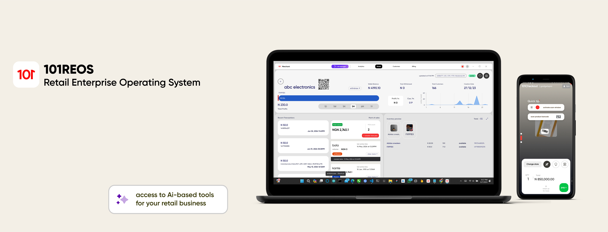
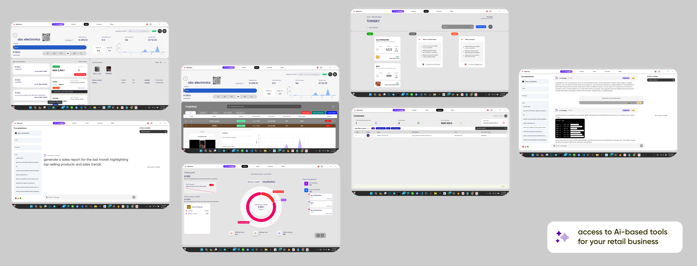

### CTO's Note on 101REOS

## What is 101REOS?

Welcome to 101REOS, the revolutionary operating system that is transforming the landscape of retail enterprises. 101REOS is not just a suite of tools; it is an ecosystem designed to supercharge your retail operations, streamline your workflows, and drive unprecedented growth. Our platform contains every tool necessary to run retail enterprises with unparalleled efficiency and effectiveness. Moreover, it provides a robust open platform for developers worldwide to build and distribute cutting-edge, innovative tools, enabling continuous evolution and adaptation in the retail sector.

## Why Did We Build 101REOS?

The vision behind 101REOS was born out of a desire to revolutionize the retail industry by leveraging technology to its fullest potential. Here’s why we built it:

- **Innovation Hub:** To create a centralized innovation hub for developing state-of-the-art tools tailored for the unique needs of retail enterprises.
- **Seamless Integration:** To facilitate the easy access and implementation of modern tools, ensuring retail businesses can adapt quickly to changing market demands.
- **Customer Experience:** To provide an enhanced and seamless experience for customers interacting with retail enterprises, making every transaction smooth and delightful.
- **Operational Efficiency:** To streamline operations, reduce overhead costs, and enhance productivity across all facets of retail management.
- **Data-Driven Decision Making:** To enable retail enterprises to harness the power of real-time data analytics, driving informed and strategic decisions.
- **Competitive Edge:** To equip retail businesses with the tools needed to stay ahead of the competition by embracing the latest technological advancements.
- **Scalability:** To provide a scalable solution that grows with the business, accommodating new stores, products, and markets effortlessly.
- **Security:** To offer robust security features that protect sensitive customer and business data, ensuring compliance with industry standards and regulations.
- **Flexibility and Customization:** To offer a flexible and customizable platform that meets the unique needs of different retail businesses, from small boutiques to large chains.

## What Have We Built So Far?

At 101REOS, we pride ourselves on delivering a comprehensive, all-in-one platform that includes:

**Advanced Point of Sales (POS) Systems**
Our POS systems are streamlined for quick and efficient transactions. With user-friendly interfaces and robust backend support, they ensure smooth checkout processes, reduce wait times, and enhance the overall customer experience.

**In-Depth Product Analysis Tools**
We provide powerful product analysis tools that offer actionable insights to optimize product offerings. By analyzing sales trends, customer preferences, and market data, retailers can make informed decisions on inventory and marketing strategies.

**Intelligent Inventory Management Systems**
Our inventory management systems ensure optimal stock levels and reduce wastage. Real-time tracking and automated reordering processes help maintain the right balance of inventory, minimizing costs and maximizing sales opportunities.

**Customer Relationship Management (CRM) Systems**
Enhancing customer engagement and loyalty is made easier with our CRM systems. These tools allow retailers to track customer interactions, manage communications, and personalize marketing efforts to build stronger customer relationships.

**Comprehensive Store Management and Analytics**
Delivering real-time insights for better decision-making, our store management and analytics tools cover everything from sales performance to employee productivity. Retailers can access detailed reports and dashboards to monitor and improve store operations.

**Cash Payment Tracking System**
Our cash payment tracking system ensures accurate and efficient financial tracking. It integrates seamlessly with other financial tools to provide a complete overview of cash flows, helping retailers manage their finances with ease.

**Next-Generation Scan-to-Pay Technology**
We offer scan-to-pay technology that makes transactions faster and more secure. Customers can simply scan products with their smartphones and pay instantly, enhancing the shopping experience and reducing checkout times.

**Mobile Self-Checkout Software**
Our mobile self-checkout software reduces checkout times and enhances customer convenience. Shoppers can scan and pay for items directly from their mobile devices, bypassing traditional checkout lines.

**Real-Time Data Analytics**
Our platform provides real-time data analytics to drive business growth. Retailers can access up-to-the-minute data on sales, inventory, and customer behavior, enabling quick and informed decision-making.

**Employee Management Systems**
Streamlining scheduling, payroll, and performance tracking is simple with our employee management systems. These tools help retailers manage their workforce efficiently, ensuring optimal staffing levels and enhancing employee productivity.

**Omni-Channel Sales Integration**
Unifying online and offline sales channels for a seamless customer experience is key with our omni-channel integration. Retailers can manage all sales platforms from a single interface, providing a consistent and integrated shopping experience.

**Loyalty Programs and Rewards Management**
Automating and optimizing customer loyalty programs is easy with our loyalty management tools. Retailers can design and implement reward schemes that incentivize repeat purchases and foster customer loyalty.

**Advanced Reporting Tools**
Our advanced reporting tools offer customizable reports for sales, inventory, and customer data. Retailers can generate detailed analytics to monitor performance, identify trends, and make strategic decisions.

**Digital Signage Solutions**
Managing in-store displays and promotions digitally is streamlined with our digital signage solutions. Retailers can update content in real-time, ensuring dynamic and engaging in-store marketing.

**Customer Feedback and Survey Tools**
Capturing and analyzing customer feedback is simplified with our survey tools. Retailers can gather insights directly from customers, helping to improve products and services continuously.

**Supply Chain Management Systems**
Enhancing supplier relationships and logistics efficiency is achievable with our supply chain management systems. These tools streamline procurement, track shipments, and ensure timely delivery of products.

**E-commerce Integration**
Seamless integration with popular e-commerce platforms for online sales is provided through our e-commerce tools. Retailers can manage their online stores alongside physical locations, creating a unified retail strategy.

**AI-Powered Application Builder**
We are thrilled to introduce our AI-Powered Application Builder, a game-changing tool that allows retail enterprise owners to create custom applications effortlessly. Here’s how it works:

> **Intuitive Chat Interface:** Business owners can describe the application they need through a user-friendly chat interface.

> **AI Understanding:** Our advanced AI system interprets the request, asking clarifying questions if necessary to fully understand the requirements.

> **Automated Development:** The AI leverages our extensive library of pre-built modules and cutting-edge technology to develop the requested application.

> **Rapid Deployment:** Once built, the application is deployed seamlessly within the 101REOS ecosystem, ready for immediate use.

> **Continuous Improvement:** The AI system learns from each interaction, improving its capabilities and expanding its library of features over time.

This groundbreaking feature democratizes access to custom software development, allowing retail businesses to quickly adapt to their unique challenges and opportunities without needing extensive technical expertise or long development cycles.

## What's Next for 101REOS?

We are just getting started. Our vision for the future includes:

- **Contactless Payment Systems:** Leading the way in secure, hygienic, and efficient transactions.
- **RFID Tagging Systems:** Revolutionizing inventory management with real-time tracking and insights.
- **Object Counting and Tracking Systems:** Enhancing operational efficiency through advanced tracking technologies.
- **Open Source Connect:** A groundbreaking open-source initiative allowing developers to create and integrate additional tools, ensuring our platform evolves with the needs of the retail industry.

To address more pain points in the retail business, we are also developing:

- **Personalized Customer Engagement Tools:** Leveraging AI to provide personalized recommendations, targeted promotions, and tailored communications.
- **Dynamic Pricing Algorithms:** Using machine learning to adjust pricing in real-time based on demand, competition, and inventory levels.
- **Automated Customer Service Chatbots:** Enhancing customer service with AI-driven chatbots capable of handling inquiries, orders, and support issues 24/7.
- **In-Store Navigation Apps:** Assisting customers in finding products quickly and efficiently within large stores through mobile apps and indoor GPS technology.
- **Automated Inventory Replenishment:** Predicting stock levels and automatically generating purchase orders to avoid out-of-stock situations.
- **Employee Training and Development Platforms:** Offering training modules and performance tracking to improve employee skills and productivity.
- **Virtual and Augmented Reality Experiences:** Creating immersive shopping experiences that blend the physical and digital worlds, enhancing customer engagement.
- **Sustainability Tracking Tools:** Monitoring and reporting on sustainability metrics, helping retailers minimize their environmental impact.
- **Mobile Workforce Management:** Enabling managers to oversee store operations, employee schedules, and performance remotely through mobile applications.
- **Advanced Fraud Detection Systems:** Using AI and machine learning to identify and prevent fraudulent transactions in real-time.

## Pioneering the Future with AI and Blockchain

At 101REOS, we are not just keeping up with technology trends; we are setting them. Our roadmap includes:

- **Artificial Intelligence:** Integrating AI for predictive analytics, personalized customer experiences, and automated operations.
- **Blockchain Technology:** Ensuring data security, transparency, and trust with blockchain-based transaction systems.

## Sustainability and Social Responsibility

We are committed to making a positive impact on the world. Our initiatives include:

- **Eco-Friendly Solutions:** Developing tools that help retailers reduce their carbon footprint and promote sustainable practices.
- **Community Engagement:** Partnering with local communities to support small businesses and drive economic growth.

## Current Partners and Collaborations

Our journey is powered by collaboration with some of the most innovative companies in the world:

- **Microsoft Founders Hub:** Leveraging world-class resources and expertise.
- **OpenAI:** Integrating cutting-edge AI technologies to drive innovation.
- **Flutterwave:** Providing seamless and secure payment solutions.

#### Join the 101REOS Revolution

We invite developers, retail enterprises, and innovators to join us in reshaping the future of retail. Together, we can create a dynamic, efficient, and customer-centric retail ecosystem. Welcome to 101REOS, where the future of retail begins today.
